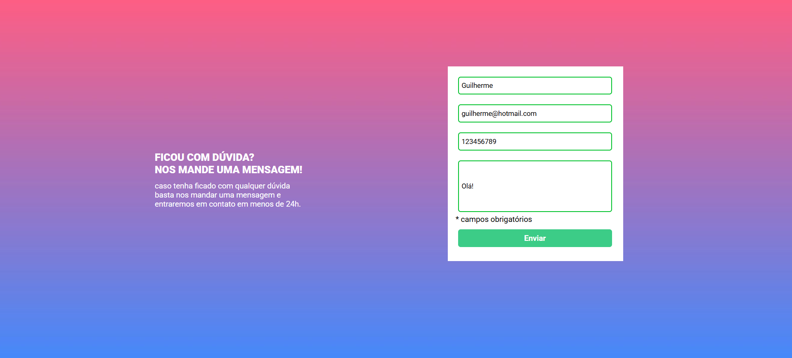
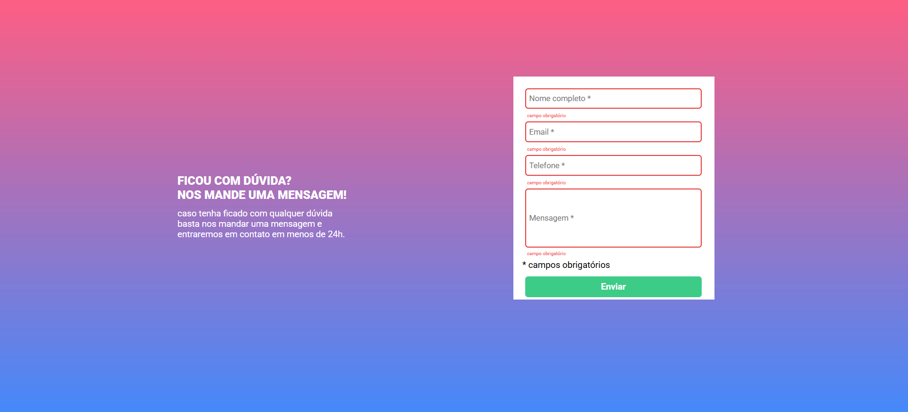

# Validação de formulário com JavaScript

Desafio realizado no curso DevQuest, onde pude testar meus conhecimentos em HTML, CSS e JavaScript. A validação do formulário é feita com JavaScript puro e, ao clicar para enviar, caso algum campo não estiver preenchido, a borda do input fica vermelha e uma mensagem de "campo obrigatório" aparece abaixo do campo que não foi preenchido.

